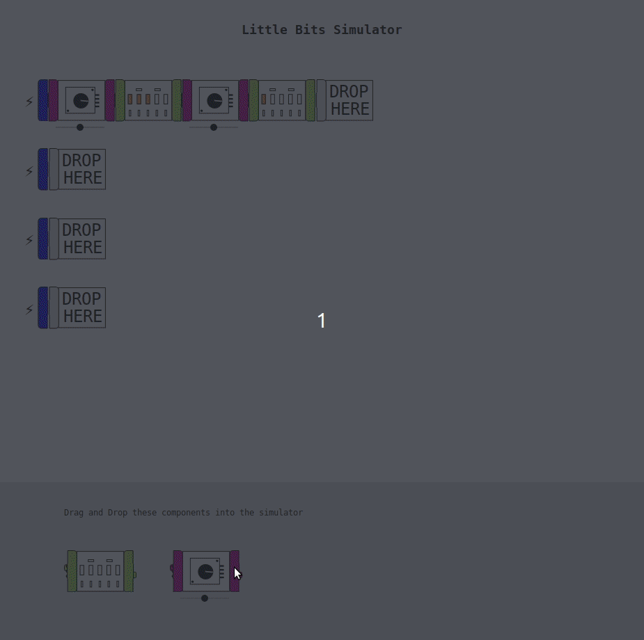

# Simulator



A React-based little bits simulator: drag and drop little bits to simulate what they would do in the real world.

Implemented bits:

- Dimmer
- Bargraph

## Technical Details

The simulator logic is separated into two parts:

1. tree re-writing for drag-and-drop support
2. voltage propagation to simulate Little Bits behaviors

The `Simulator` component recursively separates the children of it's child components from their other props so it can re-combine children with a different parent node, effectively allowing arbitrary drag-and-drop edits to a pre-defined structure.  Thus, the simulator can start with a set of nodes, but can change them based on events or state.

```jsx
<Simulator>
  <Dimmer>
    <Bargraph>
      <Dimmer>
        <Bargraph/>
      </Dimmer>
    </Bargraph>
  </Dimmer>
</Simulator>
```

The Little Bit Components use props to pass voltage information down to their child components thus allowing each component to affect or read the voltage as it moves through the connected components.  A trivial example would look like this:

```jsx
function HalfVoltage({voltage, children}) {
    const v = voltage * 0.5;
    const Child = children;
    return <Frame>
        {Child && <Child.type {...child.props} voltage={v}>{Child.children}</Child.type>}
    </Frame>;
}
```

Where the `Frame` component (slightly simplified here) handles positional logic required to prevent children from overlapping the parent or labels from being blocked.  The `Frame` component also handles drag-and-drop events in combination with the `Simulator`: this allows for dragging a `Frame`-based component onto placeholders so the `Simulator` can add them to the simulation.

Feel free to refer to the source code and comments for more information.
